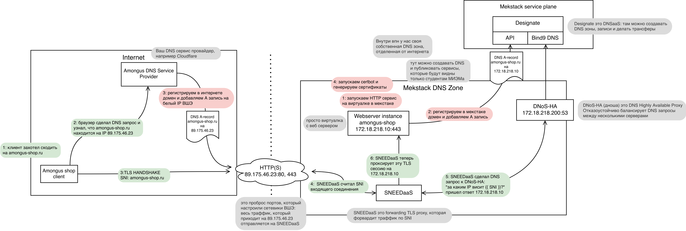

=================
Quick Start (подробное)
=================

    Тут описан процесс ручного создания виртуальной машины, подключения к VPN и
    настройки форварда HTTPS на виртуальную машину.

Если не понятно: :doc:`faq`

-------------------------------------------------------
Создание сервера в `mekstack.ru <https://mekstack.ru>`_
-------------------------------------------------------

Авторизация в облаке настроена через auth.hse.ru

В `mekstack.ru/auth/login <https://mekstack.ru/auth/login>`_ выберите
**Authenticate using Mekstack Vault**

| Дальше вас перекинет на `vault.mekstack.ru <https://vault.mekstack.ru>`_
Первоначально логин по ``oidc/``: **HSE Identity Provider**

| При входе автоматически создадутся проекты, в которых вы состоите
| Переключаться между ними можно через меню слева сверху
| Если вы не состоите ни в каких проектах, то высветится ошибка 401

..
    .. note::

       Тыкание кнопок в гуях можно пропустить и сразу раздеплоить инфру терраформом.
       `Реальный темплейт
       <https://github.com/mmskv/openstack-project-template>`_.

~~~~~~~~~~~~~~~~~~~~~~~~~~~~~~~
Создание :ref:`overlay-network`
~~~~~~~~~~~~~~~~~~~~~~~~~~~~~~~

Как создать сеть:

#. Project -> Networks -> Create Network

#. Дальше нажмите на подсеть и придумайте для нее любой CIDR. Желательно из приватных.

#. | Теперь нажмите на создание сети.
   Для избегания ошибок, не нажимайте на изменение конфигурации DNS серверов.

#. Созданная подсеть пока не работает.

   Чтобы из этой подсети можно было ходить в интернет нужно соединить её
   с нашей сетью, которая называется :ref:`public`. Соединяются сети при помощи роутеров.

   | Создайте роутер в Project -> Network -> Routers
   | В ``External Network`` должна стоять **public** сеть.

   .. image:: images/l3-lore.png
      :width: 500

#. Теперь вашу подсеть нужно подключить к новому роутеру.

| Network -> Routers -> выберите на свой Router -> Interfaces -> Add Interface -> Выбирайте свою подсеть.

~~~~~~~~~~~~~~~~~~
Настройка Секгрупп
~~~~~~~~~~~~~~~~~~

| Дальше нужно настроить фаервол, потому что по дефолту он запрещает весь входящий траффик.
| Фаервол в опенстаке называется :ref:`security-group`.

Включите ICMP (это ping) и SSH в **default** секгруппе.

#. Project -> Network -> Security Groups -> default -> Manage Rules

#. Add Rule -> All ICMP -> Add

#. Add Rule -> SSH -> Add

~~~~~~~~~~~~~~~
Запуск Инстанса
~~~~~~~~~~~~~~~

:ref:`instance` это ваша виртуальная машина

#. Compute -> Instances -> Launch Instance

#. В Source выберите образ (это как iso, но без ручной установки)

#. | Там же выберите прикреплять ли дополнительный диск к виртуальной машине кнопкой Create New Volume.
   Если не создавать, то будет только локальный диск 10-20 гигов с гипера, но он быстрее.

#. Выберите :ref:`flavor`

#. В Networks выберите свою новую сеть

#. Security Groups пусть остаются на **default**

#. В Key Pair добавь свой публичный SSH ключ

#. Запускайте инстанс

| Инстанс сейчас в вашей приватной сети, чтобы до него достучаться нужно прицепить к инстансу :ref:`fip`.
Floating IP выделяются из 172.18.218.0/23, к этой сетке есть доступ из под впн.

#. Project -> Network -> Floating IPs -> Alocate IP To Project

#. Project -> Network -> Floating IPs -> Associate

--------------------------------------------------
`vpnaas.mekstack.ru <https://vpnaas.mekstack.ru>`_
--------------------------------------------------

Сгенерируйте приватный и публичный ключ, вставьте в сайт публичный, а ваш конфигурационный файл приватный. Готово.

.. code::

    wg genkey | tee wg.key | wg pubkey
    sudo wg-quick up ./wg0.conf
    sudo wg-quick down ./wg0.conf

На Arch Wiki `написано <https://wiki.archlinux.org/title/WireGuard>`_ про Wireguard поподробнее.

~~~~~~~~~~~
Проверьте впн
~~~~~~~~~~~

.. code::

    ping 172.18.218.2

| Если работает, то можно подключаться с помощью SSH.
| Если не работает, пишите в зулип.

-------------------
Публикация сайтов
-------------------

Публикация сайта в интернете: 
Настройте форвард траффика на него

#. Сделайте A запись для своего домена на публичный адрес мекстака: 194.190.152.81

#. DNS -> Zones -> Create Zone и указываете там ваш домен

#. Нажмите на Zone -> Create Recordset -> В поле Record впишите Floating IP инстанса

#. В :ref:`security-group` инстанса разрешиnt ingress на 80 и 443 порты

#. Теперь все интернет HTTP(S) пакеты, приходящие на 194.190.152.81 с ``Host/SNI
   == {{ ваш домен }}`` будут отправляться на ваш инстанс

Для TLS используйте `сертбота <https://certbot.eff.org/lets-encrypt/>`_

Как это работает:  `схема
<https://github.com/mekstack/mekstack/blob/master/infra/sneedaas/user-data.yaml>`_.

-----------
Продолжение
-----------

За более подробной информации можно обратиться сюда в :doc:`cloud-native` (тут написано про использование Terraform, Ansible, API, openstack-cli).
